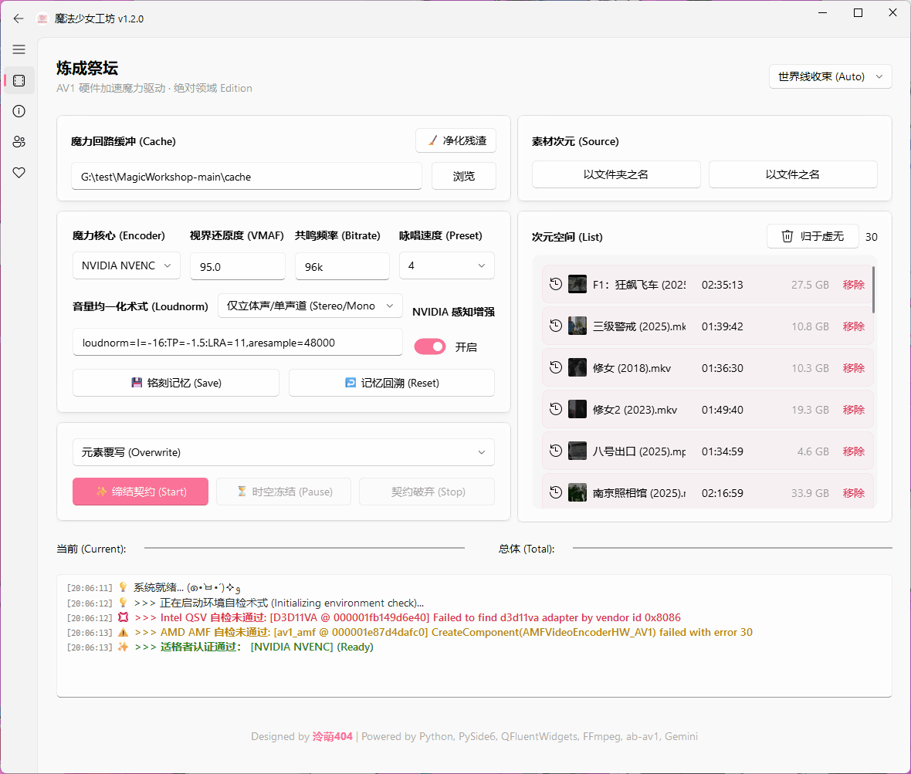
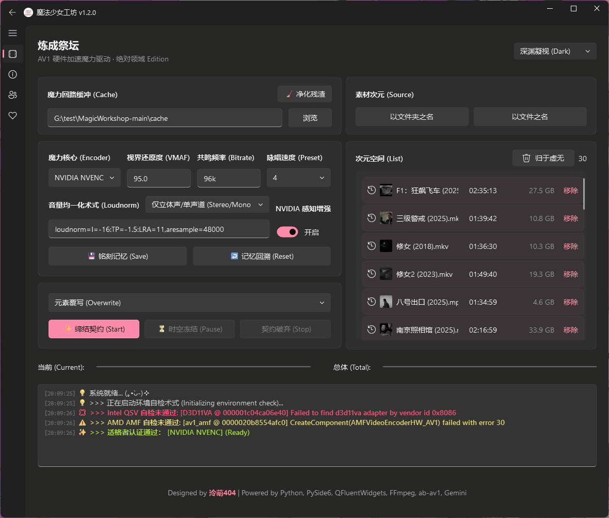

# ✨ 魔法少女工坊 (Magic Workshop) - NAS Edition


> **"NAS 媒体库洗版神器 · Intel & NVIDIA & AMD 三位一体"**
>
> 专为 **NAS 用户** 和 **仓鼠党** 打造的 AV1 硬件转码工具。
> 利用 Intel QSV、NVIDIA NVENC 或 AMD AMF 技术，在保留画质的前提下，将庞大的影视库体积缩小 **30% - 50%**。
> *Powered by Python, PySide6, QFluentWidgets, FFmpeg, ab-av1, Gemini.*

---

## 📸 界面预览




## 🎯 核心功能

*   **🚀 三核硬件加速**:
    *   **Intel QSV**: 专为 Intel Arc (A380/A750/B580) 及 Core Ultra 核显优化，满血释放 `av1_qsv` 性能。
    *   **NVIDIA NVENC**: 支持 RTX 40 系列显卡 AV1 编码，内置 **AQ (感知画质增强)** 开关，画质更细腻。
    *   **AMD AMF**: **[New]** 新增对 Radeon RX 7000 系列显卡及 RDNA 3 架构核显 (如 Ryzen 8000G) AV1 编码支持。
 *   **🧠 智能码率 (ab-av1)**: 集成 `ab-av1` 算法，根据设定的 VMAF 分数（全平台默认 93）自动测算最佳压制参数，支持 **10-bit** 深度 (AMD 暂限 8-bit)。
*   **📂 批量洗版**: 支持选择整个文件夹，自动扫描视频文件并加入队列。支持断点续传，适合挂机处理 TB 级数据。
*   **🔮 真理之眼**: 拖入视频文件即可快速查看详细媒体信息（编码、流信息、码率等），二次元风格报告。
*   **🛠️ 媒体库友好**:
    *   **音频**: 默认混缩为立体声 (Opus @ 96k + Loudnorm)，**[New]** 自动识别并保留 5.1/7.1 环绕声通道 (Opus Multichannel)。
    *   **字幕**: 智能处理字幕流 (MKV 保留特效字幕，MP4 转 SRT)，确保 Emby/Plex/Jellyfin 兼容性。
    *   **元数据**: 尽可能保留原文件的元数据信息，**[New]** 增强了对 HDR10/HLG 元数据的保留。
*   **📊 预知之眼**: UI 进度条现在不仅能显示百分比，还能实时预估**剩余时间**、**压制速度**与**当前码率**，掌控全局。
*   **🎨 Win11 风格**: 基于 `PySide6` + `QFluentWidgets` 开发，支持云母 (Mica) 特效与深色模式，界面精美。
*   **🔌 贴心辅助**: 支持任务完成后**自动关机**，以及一键清理 ab-av1 产生的临时缓存文件。

## 📊 编码器参数对比

| 特性 / 参数 | Intel QSV (默认) | NVIDIA NVENC | AMD AMF |
| :--- | :--- | :--- | :--- |
| **FFmpeg 编码器** | `av1_qsv` | `av1_nvenc` | `av1_amf` |
| **默认 VMAF 目标** | `93.0` | `93.0` | `93.0` |
| **默认灵力偏移** | `-2` | `-4` | `-6` |
| **质量控制参数** | `-global_quality:v` | `-cq` | `-qvbr_quality_level` |
| **速度预设 (Preset)** | `1` (慢) - `7` (快) | `p7` (慢) - `p1` (快) | `quality` (慢) - `speed` (快) |
| **码率控制模式** | 硬件 ICQ 模式 | `vbr` + `-b:v 0` | `vbr_latency` + QVBR |
| **感知增强 (AQ)** | 默认启用 (Lookahead) | 默认启用 (Spatial/Temporal) | 默认启用 (Pre-Analysis) |
 | **像素格式** | `p010le` (10-bit) | `p010le` (10-bit) | `yuv420p` (8-bit) |
| **特殊优化** | `-async_depth 1` (防溢出) | 解除码率限制 (`-b:v 0`) | 启用 VBAQ 自适应量化 |
| **硬件门槛** | Intel Arc / Core Ultra | NVIDIA RTX 40 系列 | AMD RX 7000 / RDNA 3 |

*注：由于三家算法不同，相同的质量数值（如 30）在不同显卡上的表现不可直接类比，请以 VMAF 结果为准。*
*预设映射：软件界面统一使用 `1` (慢/高质量) - `7` (快/低质量) 的数字。NVIDIA 映射为 `p7`→`p1`；AMD 映射为：`1-2`→`quality`, `3-5`→`balanced`, `6-7`→`speed`。*

## 🧪 VMAF 调优指南

本工具通过 `ab-av1` 自动寻找最佳 ICQ 码率。VMAF 是衡量画质的关键指标：
*   **VMAF 95+ (极高画质)**: 适合 4K HDR 收藏，画质几乎等同于原盘，体积缩减约 20-30%。
*   **VMAF 93 (推荐平衡)**: **默认设置**。肉眼无损的黄金分割点，体积缩减可达 40-60%。
*   **VMAF 90 (高压缩比)**: 适合在平板或手机上观看，在保持良好观感的前提下极大节省空间。
*   **VMAF < 85**: 可能会出现可见的压缩伪影，不建议用于长期收藏。
*   （全平台默认推荐 93，但画质仍会有差距 `(QSV > NVENC > AMF)` ，可根据个人喜好微调）

## ⚙️ 系统要求

*   **操作系统**: Windows 10 / 11 (推荐 Win11 以获得最佳 UI 体验)
*   **显卡**: **必须** 支持 AV1 硬件编码
    *   🔵 **Intel**: Arc A380 / A750 / B580 等独显，或 Core Ultra 系列核显。
    *   🟢 **NVIDIA**: GeForce RTX 40 系列 (如 RTX 4060 / 4080 / 4090)。
    *   🔴 **AMD**: Radeon RX 7000 系列独显或 RDNA 3 架构核显 (如 Ryzen 8000G)。*(注: 由于需使用 CPU 辅助探测，建议搭配较新 CPU 以获得最佳体验)*
    *   *注意: 旧款 NVIDIA (30系及以下) 及 AMD (RX 6000系及以下) 不支持。*
*   **驱动**: 请安装最新的显卡驱动。

### 🔍 硬件兼容性自测
程序启动时会自动检测环境（真实初始化硬件）。

**软件内状态 (GUI Log):**
*   **✅ 通过**: `>>> 适格者认证通过： [Intel QSV] [NVIDIA NVENC] [AMD AMF] (Ready)` (根据实际硬件显示)
*   **❌ 失败**: `>>> 警告：未侦测到有效的 AV1 硬件编码器...`

**手动确认 (Terminal):**
如果您想手动确认，请在终端执行对应显卡的检测命令：

**Intel QSV:**
```bash
.\tools\ffmpeg.exe -init_hw_device qsv=hw -f lavfi -i color=black:s=1280x720 -pix_fmt p010le -c:v av1_qsv -frames:v 1 -f null - -v error
```
**NVIDIA NVENC:**
```bash
.\tools\ffmpeg.exe -f lavfi -i color=black:s=1280x720 -pix_fmt p010le -c:v av1_nvenc -frames:v 1 -f null - -v error
```
**AMD AMF:**
```bash
.\tools\ffmpeg.exe -f lavfi -i color=black:s=1280x720 -pix_fmt yuv420p -c:v av1_amf -usage transcoding -quality balanced -rc vbr_latency -qvbr_quality_level 30 -frames:v 1 -f null - -v error
```

*   **无输出**: 恭喜！您的硬件完美支持 QSV, NVENC 或 AMF AV1 硬件编码。
*   **有输出 (报错)**: 说明您的显卡不支持对应的硬件编码器或驱动未正确安装。

## 📥 下载与使用

### 方式一：下载正式版 (推荐)

1.  前往 [**Releases 页面**](https://github.com/LingMoe404/MagicWorkshop/releases) 下载最新版本的压缩包。
2.  解压至任意目录。
3.  双击 `MagicWorkshop.exe` 即可直接使用 (已内置 FFmpeg, ab-av1 等核心组件，无需额外配置)。

### 方式二：源码运行 (Dev)

如果您熟悉 Python 开发，可以使用源码运行：

1.  **克隆仓库**
    ```bash
    git clone https://github.com/LingMoe404/MagicWorkshop.git
    cd MagicWorkshop
    ```

2.  **安装依赖**
    本项目推荐使用 `uv` 进行依赖管理 (根目录已包含 `uv.lock`)。
    ```bash
    # 安装 uv
    pip install uv
    # 同步环境
    uv sync
    ```
    *或者使用 pip 安装核心库: `pip install PySide6 PySide6-Fluent-Widgets`*

3.  **准备工具链**
    请确保项目根目录下的 `tools/` 文件夹内包含以下可执行文件：
    *   `ffmpeg.exe` & `ffprobe.exe`: **注意**：仓库源码中上传的是 `essentials` 版本，缺少部分编码支持。建议前往 gyan.dev 下载 `ffmpeg-release-full.7z` (Full 版本) 并替换。*(注：下载的正式版 Releases 压缩包已内置 Full 版本，无需额外操作)*
    *   `ab-av1.exe`

4.  **启动**
    ```bash
    # 使用 uv
    uv run main.py
    
    # 或标准 python
    python main.py
    ```

---

## 🚀 更新日志

*   **v1.2.1 (2026-02-17)**
    *   🛡️ **探测逻辑重构**: 为所有硬件编码器 (QSV/NVENC/AMF) 引入“三级探测策略” (硬件 -> SVT-AV1 -> AOM-AV1)。特别说明：由于 `ab-av1` 原生不支持 AMF，AMD 模式将强制使用 CPU (SVT-AV1 -> AOM-AV1) 进行探测并换算参数。
    *   🎚️ **全域灵力偏移**: 开放“灵力偏移” (CRF Offset) 调节功能，支持针对 CPU 探测结果进行微调 (默认: QSV -2 / NVENC -4 / AMF -6)。
    *   ⚡ **性能监控**: 任务列表新增实时压制速度 (Speed) 和剩余时间预估 (ETA) 显示；任务完成后常驻显示耗时统计。
    *   🐛 **Bug 修复**: 修复了输入文件包含封面图 (MJPEG) 时导致 `ab-av1` 识别错误并崩溃的问题；修复了极短视频或多音轨视频导致的进度条计算异常；优化了 UI 列表布局。

*   **v1.2.0 (2026-02-16)**
    *   🔴 **新增 AMD AMF AV1 硬件编码支持**: 适配 Radeon RX 7000 系列及 RDNA 3 核显。
    *   🔊 **音频增强**: 智能识别并保留 5.1/7.1 多声道 (Opus Multichannel)，新增响度标准化 (Loudnorm) 智能模式，避免破坏环绕声动态。
    *   ⚡ **核心重构**: 底层框架迁移至 **PySide6**，引入异步任务队列与日志缓冲池，大幅提升大量文件列表下的 UI 响应速度。
    *   🌈 **画质优化**: 全程强制 10-bit 像素处理 (AMD 为 8-bit)，优化 HDR 色彩保留；NVENC/QSV/AMF 均已启用感知增强 (AQ/Lookahead/PreAnalysis)。
    *   🛠️ **体验升级**: 优化了任务进度条显示，增加剩余时间预估；修复了停止任务时后台进程残留的 Bug。

*   **v1.1.0 (2026-02-13)**
    *   💡 **新增 NVIDIA NVENC AV1 硬件编码支持** (需 RTX 40 系列)。
    *   ⚙️ 优化硬件检测逻辑，区分显卡型号和驱动问题。
    *   🚀 修复 `ab-av1` 参数兼容性问题，大幅提升 NVENC 压制画质 (开启 AQ 感知增强)。
    *   📝 增加日志 VMAF 实时显示，NVENC 感知增强开关，以及 VMAF 默认值智能切换。

*   **v1.0.0 (2026-01-28)**
    *   🎉 首次发布！支持 Intel QSV AV1 硬件编码。
    *   ✨ 集成 `ab-av1` 智能 VMAF 码率控制。
    *   🎨 Win11 Fluent Design 风格界面。

## 🛠️ 常见问题

**Q: 为什么启动时提示“结界破损警告”？**
A: 说明程序目录下的 `tools/` 文件夹内缺少 `ffmpeg.exe`、`ffprobe.exe` 或 `ab-av1.exe`。请确保这些工具存在于 `tools/` 目录中。

**Q: 为什么部分视频转码失败？**
A: 源码仓库中有单文件体积限制，上传的 `ffmpeg.exe` 为 `essentials` 版本，可能缺少部分非主流编码格式的支持。建议前往 gyan.dev 下载 `ffmpeg-release-full.7z` (Full 版本) 并替换 `tools/` 目录下的文件。*(注：Releases 发布页下载的正式版已内置 Full 版本)*

**Q: 为什么点击开始后直接报错/闪退？**
A: 请检查您的显卡是否支持 AV1 硬件编码。
   - **Intel**: 需要 Arc A380/A750/B580 或 Core Ultra 核显。
   - **NVIDIA**: 需要 RTX 40 系列 (如 4060/4080/4090)。
   - **AMD**: 需要 Radeon RX 7000 系列或 RDNA 3 架构核显。

**Q: 为什么 AMD 模式下显示 "CPU 探测"？**
A: 由于核心组件 `ab-av1` 目前尚未原生支持 AMD AMF 硬件编码器。为了实现自动码率控制，程序会使用 CPU (SVT-AV1 -> AOM-AV1) 进行“代理探测”，然后通过算法将结果换算为 AMF 所需的参数。虽然探测阶段会占用 CPU，但最终的转码过程依然是纯硬件加速的。

**Q: 转换后的 MKV 字幕显示不正常？**
A: 程序会自动判断：如果是 MP4 源文件，字幕会转为 SRT 以兼容 MKV；如果是 MKV 源文件，则保留原始字幕（如 ASS 特效）。

## 💡 给 NAS 用户的建议

*   **路径映射**: 为了获得最佳稳定性，建议将 NAS 的共享文件夹映射为本地磁盘（例如映射为 `Z:` 盘），然后再拖入软件处理，避免使用 `\\192.168.x.x` 路径。
*   **虚拟机直通或 SR-IOV**: 如果您是在宿主机系统下的 Windows 虚拟机中使用，请确保显卡已正确直通 (Passthrough) 或 SR-IOV 虚拟，并安装了最新的显卡驱动 (Intel/NVIDIA/AMD)。
*   **原始文件**: 软件默认开启“覆盖源文件”模式，但对于珍贵的原盘资源，建议先开启“另存为”模式测试效果。

## 🔗 关于作者

我是 **泠萌404**，一名喜欢折腾硬件、NAS的普通上班族。

| 平台 | ID / 频道 | 链接 |
| :--- | :--- | :--- |
| Bilibili | **泠萌404** | [点击跳转](https://space.bilibili.com/136850) |
| YouTube | **泠萌404** | [点击跳转](https://www.youtube.com/@LingMoe404) |
| Douyin | **泠萌404** | [点击跳转](https://www.douyin.com/user/MS4wLjABAAAA8fYebaVF2xlczanlTvT-bVoRxLqNjp5Tr01pV8wM88Q) |

## 🙏 致谢

本项目离不开以下优秀的开源项目与工具的支持：

*   [**FFmpeg**](https://ffmpeg.org/): 强大的多媒体处理框架。
*   [**ab-av1**](https://github.com/alexheretic/ab-av1): 自动寻找最佳 AV1 编码参数的工具。
*   [**PySide6**](https://doc.qt.io/qtforpython/): Python 的 Qt 绑定。
*   [**QFluentWidgets**](https://github.com/zhiyiYo/PyQt-Fluent-Widgets): 精美的 Fluent Design 风格组件库。
*   [**Google Gemini**](https://deepmind.google/technologies/gemini/): 提供了强大的代码生成与辅助能力。

## 🤖 开发幕后

本项目是一个纯粹的 **AI 辅助开发** 实验。
**100% 的代码** 均由 **Google Gemini** 在我的 Prompt 引导下生成。
我负责提供逻辑架构和需求，AI 负责编写 Python 代码和 UI 实现。

## 🤝 贡献指南 (Contributing)

欢迎各位适格者参与到魔法少女工坊的建设中！无论是修复 Bug、优化文档还是提交新功能，我们都非常感谢。

1.  **Fork 项目**: 将仓库 Fork 到您的 GitHub 账户。
2.  **获取源码**: 克隆您的 Fork 仓库到本地。
3.  **环境准备**: 请参考上文的 [源码运行 (Dev)](#方式二源码运行-dev) 章节配置 Python 环境 (推荐 `uv`) 及 FFmpeg 工具链。
4.  **开发与提交**:
    *   新建分支 (`git checkout -b feat/new-feature`)。
    *   提交代码 (`git commit -m "feat: add new feature"`)。
    *   推送到远程 (`git push origin feat/new-feature`)。
5.  **发起 PR**: 在 GitHub 上提交 Pull Request 至 `main` 分支。

## 📜 开源协议

本项目遵循 GPL-3.0 开源协议。

*   **GUI**: 基于 PySide6 和 QFluentWidgets (GPLv3)。
*   **Core**: 核心算法基于 FFmpeg (LGPL/GPL) 和 ab-av1 (MIT)。
*   **License**: MagicWorkshop by 泠萌404 is licensed under GPL-3.0.

Copyright © 2026 泠萌404
