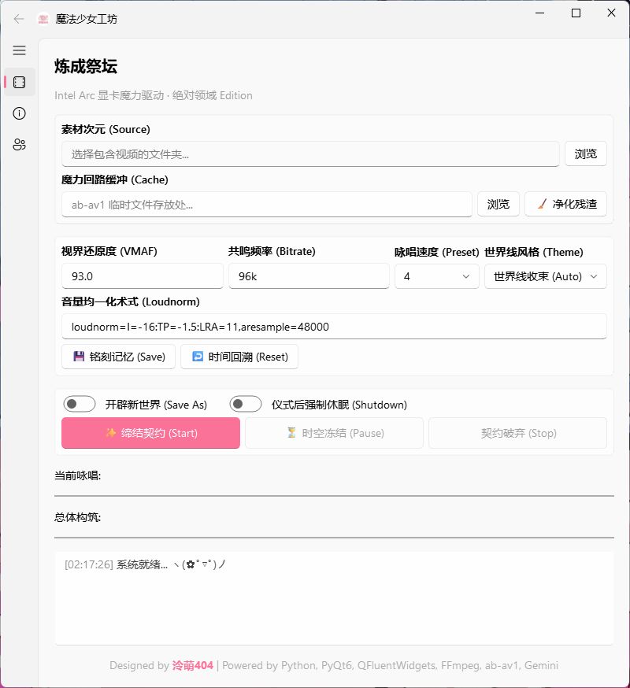
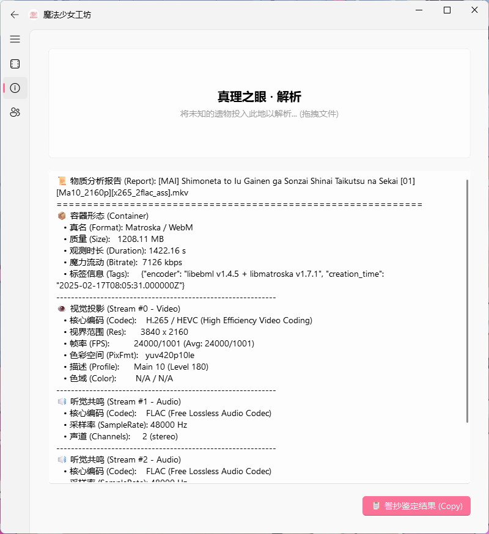

# ✨ 魔法少女工坊 (Magic Workshop) - NAS Edition


> **"NAS 媒体库洗版神器 · Intel Arc & Ultra 显卡专用"**
>
> 专为 **NAS 用户** 和 **仓鼠党** 打造的 AV1 硬件转码工具。
> 利用 Intel QSV (Quick Sync Video) 技术，在保留画质的前提下，将庞大的影视库体积缩小 **30% - 50%**。
> *Powered by Python, PyQt6, QFluentWidgets, FFmpeg, ab-av1, Gemini.*

---

## 📸 界面预览




## 🎯 核心功能

*   **🚀 Intel QSV 硬件加速**: 专为 **Intel Arc (A380/A750/B580)等独显** 及 **Core Ultra (如 265T)** 核显优化，满血释放 `av1_qsv` 编码性能。
*   **🧠 智能码率 (ab-av1)**: 集成 `ab-av1` 算法，根据设定的 VMAF 分数（如 93+）自动测算最佳压制参数 (ICQ)，支持 **10-bit** 深度，告别盲猜码率。
*   **📂 批量洗版**: 支持选择整个文件夹，自动扫描视频文件并加入队列。支持断点续传，适合挂机处理 TB 级数据。
*   **🔮 真理之眼**: 拖入视频文件即可快速查看详细媒体信息（编码、流信息、码率等），二次元风格报告。
*   **🛠️ 媒体库友好**:
    *   **音频**: 强制混缩为立体声 (Opus @ 96k + Loudnorm)，适合移动端/平板/电视外放。*(注：暂不支持保留 5.1/7.1 环绕声)*
    *   **字幕**: 智能处理字幕流 (MKV 保留特效字幕，MP4 转 SRT)，确保 Emby/Plex/Jellyfin 兼容性。
    *   **元数据**: 尽可能保留原文件的元数据信息。
*   **🎨 Win11 风格**: 基于 `PyQt6-Fluent-Widgets` 开发，支持云母 (Mica) 特效与深色模式，界面精美。
*   **🔌 贴心辅助**: 支持任务完成后**自动关机**，以及一键清理 ab-av1 产生的临时缓存文件。

## 🧪 VMAF 调优指南

本工具通过 `ab-av1` 自动寻找最佳 ICQ 码率。VMAF 是衡量画质的关键指标：
*   **VMAF 95+ (极高画质)**: 适合 4K HDR 收藏，画质几乎等同于原盘，体积缩减约 20-30%。
*   **VMAF 93 (推荐平衡)**: **默认设置**。肉眼无损的黄金分割点，体积缩减可达 40-60%。
*   **VMAF 90 (高压缩比)**: 适合在平板或手机上观看，在保持良好观感的前提下极大节省空间。
*   **VMAF < 85**: 可能会出现可见的压缩伪影，不建议用于长期收藏。

## ⚙️ 系统要求

*   **操作系统**: Windows 10 / 11 (推荐 Win11 以获得最佳 UI 体验)
*   **显卡**: **必须** 是支持 AV1 硬件编码的 Intel 显卡
    *   Intel Arc A380 / A750 / B580 等（独显）
    *   Intel Core Ultra 系列 (核显)
    *   *注意: NVIDIA 和 AMD 显卡暂不支持（代码中硬编码了 `av1_qsv`）*
*   **驱动**: 请安装最新的 Intel 显卡驱动。

### 🔍 硬件兼容性自测
程序启动时会自动检测环境（真实初始化硬件）。

**软件内状态 (GUI Log):**
*   **✅ 通过**: `>>> 适格者认证通过：Intel QSV 动力源同步率 100%！(Ready)`
*   **❌ 失败**: `>>> 警告：未侦测到 Intel QSV AV1 魔力源...`

**手动确认 (Terminal):**
如果您想手动确认，请在终端执行：
```bash
.\ffmpeg.exe -f lavfi -i color=s=128x128 -c:v av1_qsv -frames:v 1 -f null - -v error
```
*   **无输出**: 恭喜！您的硬件完美支持 QSV AV1 硬件编码。
*   **有输出 (报错)**: 说明您的显卡不支持 QSV AV1 或驱动未正确安装。

## 📥 下载与使用

### 方式一：下载便携版 (推荐)

1.  前往 Releases 页面下载最新压缩包。
2.  解压后，请确保目录结构如下（需手动下载组件）：
    ```text
    MagicWorkshop/
    ├── 魔法少女工坊_Lite.exe
    ├── ffmpeg.exe       <-- 必须存在
    ├── ffprobe.exe      <-- 必须存在
    └── ab-av1.exe       <-- 必须存在
    ```
3.  双击 `魔法少女工坊_Lite.exe` 启动。

### 方式二：源码运行

如果您想自行修改或学习代码：

1.  **克隆仓库**
    ```bash
    git clone https://github.com/Lemon4289/MagicWorkshop.git
    cd MagicWorkshop
    ```

2.  **安装依赖**
    ```bash
    pip install PyQt6 PyQt6-Fluent-Widgets
    ```

3.  **准备核心组件**
    *   下载 FFmpeg & FFprobe (https://www.gyan.dev/ffmpeg/builds) (推荐 `ffmpeg-release-full.7z`)
    *   下载 ab-av1 (https://github.com/alexheretic/ab-av1/releases) (请下载 Windows 版本并重命名为 `ab-av1.exe`)
    *   将 `ffmpeg.exe`, `ffprobe.exe`, `ab-av1.exe` 放入项目根目录。

4.  **运行**
    ```bash
    python main.py
    ```

## 🛠️ 常见问题

**Q: 为什么启动时提示“结界破损警告”？**
A: 说明程序目录下缺少 `ffmpeg.exe`、`ffprobe.exe` 或 `ab-av1.exe`。请下载这些工具并和 exe 放在一起。

**Q: 为什么点击开始后直接报错/闪退？**
A: 请检查您的显卡是否支持 Intel QSV AV1 编码。如果使用 NVIDIA & AMD 显卡，当前版本无法运行。

**Q: 转换后的 MKV 字幕显示不正常？**
A: 程序会自动判断：如果是 MP4 源文件，字幕会转为 SRT 以兼容 MKV；如果是 MKV 源文件，则保留原始字幕（如 ASS 特效）。

## 💡 给 NAS 用户的建议

*   **路径映射**: 为了获得最佳稳定性，建议将 NAS 的共享文件夹映射为本地磁盘（例如映射为 `Z:` 盘），然后再拖入软件处理，避免使用 `\\192.168.x.x` 路径。
*   **虚拟机直通或 SR-IOV**: 如果您是在宿主机系统下的 Windows 虚拟机中使用，请确保核显已正确直通或 SR-IOV 虚拟并安装了最新的 Intel 驱动。
*   **原始文件**: 软件默认开启“覆盖源文件”模式，但对于珍贵的原盘资源，建议先开启“另存为”模式测试效果。

## 🔗 关于作者

我是 **泠萌404**，一名喜欢折腾硬件、NAS的普通上班族。

| 平台 | ID / 频道 | 链接 |
| :--- | :--- | :--- |
| Bilibili | **泠萌404** | [点击跳转](https://space.bilibili.com/136850) |
| YouTube | **泠萌404** | [点击跳转](https://www.youtube.com/@LingMeng404) |
| Douyin | **泠萌404** | [点击跳转](https://www.douyin.com/user/MS4wLjABAAAA8fYebaVF2xlczanlTvT-bVoRxLqNjp5Tr01pV8wM88Q) |

## 🙏 致谢

本项目离不开以下优秀的开源项目与工具的支持：

*   [**FFmpeg**](https://ffmpeg.org/): 强大的多媒体处理框架。
*   [**ab-av1**](https://github.com/alexheretic/ab-av1): 自动寻找最佳 AV1 编码参数的工具。
*   [**PyQt6**](https://www.riverbankcomputing.com/software/pyqt/): Python 的 Qt 绑定。
*   [**PyQt-Fluent-Widgets**](https://github.com/zhiyiYo/PyQt-Fluent-Widgets): 精美的 Fluent Design 风格组件库。
*   [**Google Gemini**](https://deepmind.google/technologies/gemini/): 提供了强大的代码生成与辅助能力。

## 🤖 开发幕后

本项目是一个纯粹的 **AI 辅助开发** 实验。
**100% 的代码** 均由 **Google Gemini** 在我的 Prompt 引导下生成。
我负责提供逻辑架构和需求，AI 负责编写 Python 代码和 UI 实现。

## 📜 开源协议

本项目遵循 GPL-3.0 开源协议。

*   **GUI**: 基于 PyQt6 和 QFluentWidgets (GPLv3)。
*   **Core**: 核心算法基于 FFmpeg (LGPL/GPL) 和 ab-av1 (MIT)。
*   **License**: MagicWorkshop by 泠萌404 is licensed under GPL-3.0.

Copyright © 2026 泠萌404
