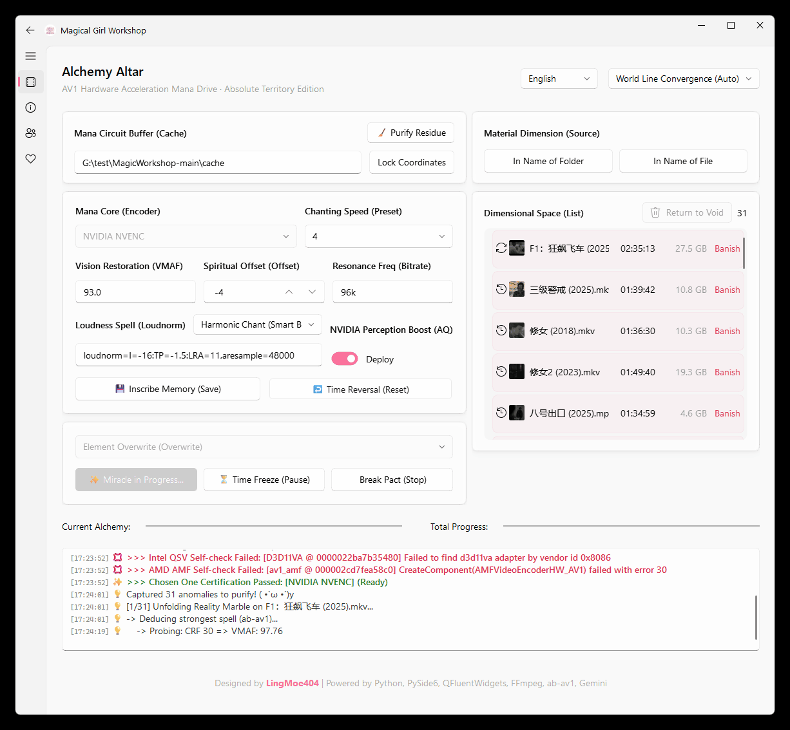

# ✨ Magical Girl Workshop - Windows Edition


[中文](README.md) | [日本語](README_JP.md)

> **"The Ultimate Purification Tool for NAS & PC Digital Hoarders · VMAF-Driven Smart Encoder"**
>
> A smart AV1 hardware transcoding tool running on Windows, built specifically for **NAS users** and **digital hoarders** .<br>
> Driven by **VMAF intelligent calculation** to auto-find optimal bitrates, it utilizes Intel QSV, NVIDIA NVENC, or AMD AMF technology to reduce the size of massive video libraries by **30% - 50%** while preserving visually lossless image quality, saving your local hard drive and NAS space.<br>
> *Powered by Python, PySide6, QFluentWidgets, FFmpeg, ab-av1, Gemini.*

---

## 📸 Interface Preview



## 🎯 Core Features

*   **🚀 Triple-Core Hardware Acceleration**:
    *   **Intel QSV**: Optimized for Intel Arc (A380/A750/B580) & Core Ultra iGPUs, fully unleashing `av1_qsv` performance.
    *   **NVIDIA NVENC**: Supports RTX 40 series AV1 encoding, with built-in **AQ (Adaptive Quantization)** switch for finer quality.
    *   **AMD AMF**: **[New]** Added support for Radeon RX 7000 series & RDNA 3 iGPUs (e.g., Ryzen 8000G) AV1 encoding.
*   **🧠 Smart Bitrate (ab-av1)**: Integrated `ab-av1` algorithm, automatically calculating optimal encoding parameters based on target VMAF score (default 93 across platforms), supporting **10-bit** depth (AMD currently limited to 8-bit).
*   **📂 Batch Purification**: Supports selecting entire folders, automatically scanning video files into the queue. Supports resume from breakpoint, suitable for unattended processing of TB-level data.
*   **🔮 Eye of Truth**: Drag and drop video files to quickly view detailed media info (codec, stream info, bitrate, etc.) with an anime-style report.
*   **🛠️ Media Library Friendly**:
    *   **Audio**: Default mixdown to stereo (Opus @ 96k + Loudnorm), **[New]** automatically identifies and preserves 5.1/7.1 surround sound channels (Opus Multichannel).
    *   **Subtitles**: Smart subtitle processing (MKV retains effect subtitles, MP4 converts to SRT), ensuring compatibility with Emby/Plex/Jellyfin.
    *   **Metadata**: Preserves original file metadata as much as possible.
*   **📊 Eye of Foresight**: UI progress bar now displays not only percentage but also real-time estimates for **remaining time**, **encoding speed**, and **current bitrate**, keeping you in control.
*   **🎨 Win11 Style**: Built with `PySide6` + `QFluentWidgets`, supporting Mica effects and dark mode, with a beautiful interface.
*   **🔌 Thoughtful Assistance**: Supports **auto-shutdown** after task completion, and one-click cleanup of temporary cache files generated by ab-av1.

## 📊 Encoder Comparison

| Feature / Parameter | Intel QSV (Default) | NVIDIA NVENC | AMD AMF |
| :--- | :--- | :--- | :--- |
| **FFmpeg Encoder** | `av1_qsv` | `av1_nvenc` | `av1_amf` |
| **Default VMAF Target** | `93.0` | `93.0` | `93.0` |
| **Default Offset** | `-2` | `-4` | `-6` |
| **Quality Control** | `-global_quality:v` | `-cq` | `-qvbr_quality_level` |
| **Preset** | `1` (Slow) - `7` (Fast) | `p7` (Slow) - `p1` (Fast) | `quality` (Slow) - `speed` (Fast) |
| **Bitrate Control** | Hardware ICQ | `vbr` + `-b:v 0` | `vbr_latency` + QVBR |
| **Adaptive Quantization (AQ)** | Enabled (Lookahead) | Enabled (Spatial/Temporal) | Enabled (Pre-Analysis) |
| **Pixel Format** | `p010le` (10-bit) | `p010le` (10-bit) | `yuv420p` (8-bit) |
| **Special Optimization** | `-async_depth 1` (Overflow Prev.) | Uncapped Bitrate (`-b:v 0`) | VBAQ Enabled |
| **Hardware Requirement** | Intel Arc / Core Ultra | NVIDIA RTX 40 Series | AMD RX 7000 / RDNA 3 |

*Note: Due to different algorithms, the same quality value (e.g., 30) is not directly comparable across vendors. Please rely on VMAF results.*
*Preset Mapping: The software UI unifies presets as `1` (Slow/High Quality) - `7` (Fast/Low Quality). NVIDIA maps to `p7`→`p1`; AMD maps to: `1-2`→`quality`, `3-5`→`balanced`, `6-7`→`speed`.*

## 🧪 VMAF Tuning Guide

For detailed VMAF parameter explanation and quality suggestions, please refer to VMAF_GUIDE.

## ⚙️ System Requirements

*   **OS**: Windows 10 / 11 (Win11 recommended for best UI experience)
*   **GPU**: **Must** support AV1 hardware encoding
    *   🔵 **Intel**: Arc A380 / A750 / B580 dGPUs, or Core Ultra series iGPUs.
    *   🟢 **NVIDIA**: GeForce RTX 40 Series (e.g., RTX 4060 / 4080 / 4090).
    *   🔴 **AMD**: Radeon RX 7000 Series dGPUs or RDNA 3 architecture iGPUs (e.g., Ryzen 8000G). *(Note: Requires CPU-assisted probing, newer CPU recommended for best experience)*
    *   *Note: Older NVIDIA (30 series & below) and AMD (RX 6000 series & below) are NOT supported.*
*   **Driver**: Please install the latest graphics driver.

### 🔍 Hardware Compatibility Check

For detailed hardware self-check methods, please refer to HARDWARE_CHECK.

## 📥 Download & Usage

### Method 1: Download Official Release (Recommended)

1.  Go to the **Releases Page** and download the latest zip package.
2.  Unzip to any directory.
3.  Double-click `MagicalGirlWorkshop.exe` to use directly (FFmpeg, ab-av1, etc. are built-in, no extra configuration needed).

### Method 2: Run from Source (Dev)

If you are familiar with Python development, you can run from source:

1.  **Clone Repository**
    ```bash
    git clone https://github.com/LingMoe404/MagicalGirlWorkshop.git
    cd MagicalGirlWorkshop
    ```

2.  **Install Dependencies**
    This project recommends using `uv` for dependency management (`uv.lock` is included).
    ```bash
    # Install uv
    pip install uv
    # Sync environment
    uv sync
    ```
    *Or install core libraries via pip: `pip install PySide6 PySide6-Fluent-Widgets`*

3.  **Prepare Toolchain**
    Ensure the `tools/` folder in the project root contains the following executables:
    *   `ffmpeg.exe` & `ffprobe.exe`: **Note**: The source repo contains the `essentials` version which lacks some codec support. It is recommended to download `ffmpeg-release-full.7z` (Full Version) from gyan.dev and replace them. *(Note: The official Releases zip already includes the Full Version, no action needed)*
    *   `ab-av1.exe`

4.  **Launch**
    ```bash
    # Using uv
    uv run main.py
    
    # Or standard python
    python main.py
    ```

---

## 🚀 Changelog

For detailed changelog, please refer to CHANGELOG.

## 🛠️ FAQ

For frequently asked questions and NAS user tips, please refer to FAQ.

## 🔗 About Author

I am **LingMoe404**, an ordinary office worker who loves tinkering with hardware and NAS.

| Platform | ID / Channel | Link |
| :--- | :--- | :--- |
| Bilibili | **泠萌404** | Click to Visit |
| YouTube | **LingMoe404** | Click to Visit |
| Douyin | **泠萌404** | Click to Visit |

## 🙏 Acknowledgements

This project is made possible by the following excellent open-source projects and tools:

*   **FFmpeg**: Powerful multimedia processing framework.
*   **ab-av1**: Tool for automatically finding the best AV1 encoding parameters.
*   **PySide6**: Python bindings for Qt.
*   **QFluentWidgets**: Beautiful Fluent Design style component library.
*   **Google Gemini**: Provided powerful code generation and assistance capabilities.

## 🤖 Behind the Scenes

This project is a pure **AI-Augmented Development** experiment.
**100% of the code** was generated by **Google Gemini** under my Prompt guidance.
I provided the logical architecture and requirements, and AI was responsible for writing the Python code and UI implementation.

## 🤝 Contributing

We welcome all "Chosen Ones" to participate in the construction of the Magical Girl Workshop! Whether it's fixing bugs, optimizing documentation, or submitting new features, we are very grateful.

For detailed contribution processes and development guidelines, please refer to CONTRIBUTING.

## 📜 License

This project is licensed under the GPL-3.0 Open Source License.

*   **GUI**: Based on PySide6 and QFluentWidgets (GPLv3).
*   **Core**: Core algorithms based on FFmpeg (LGPL/GPL) and ab-av1 (MIT).
*   **License**: MagicalGirlWorkshop by LingMoe404 is licensed under GPL-3.0.


Copyright © 2026 LingMoe404


