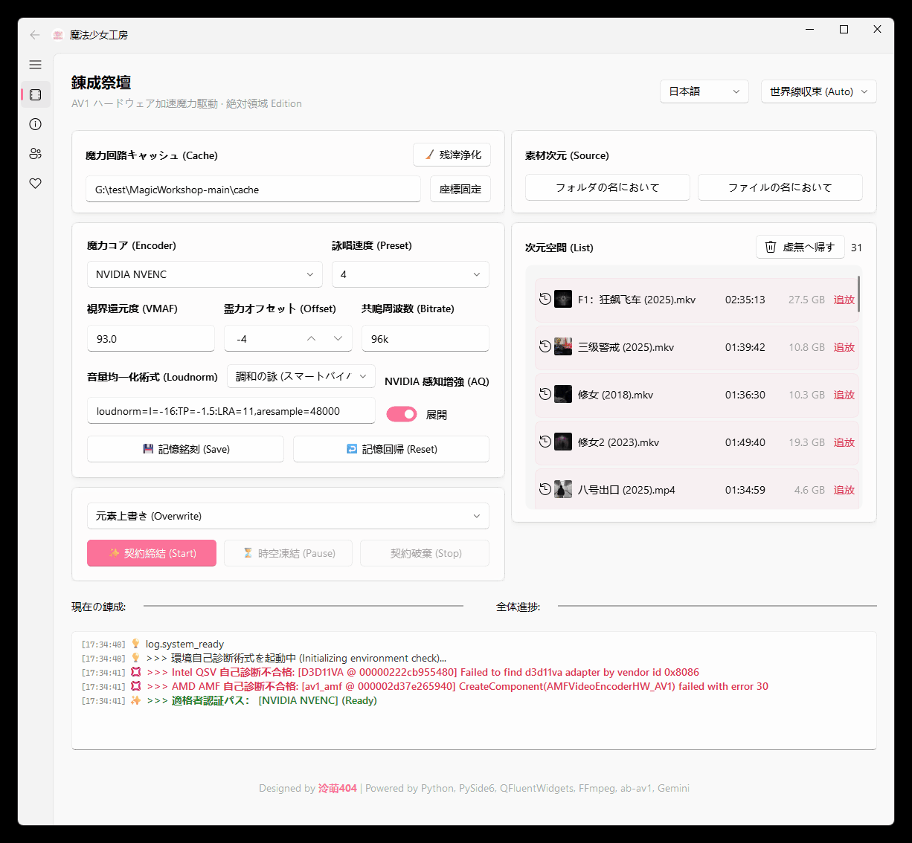

# ✨ 魔法少女工房 (Magical Girl Workshop) - NAS Edition


[中文](README.md) | [English](README_EN.md)

> **"NASメディアライブラリ浄化ツール · Intel & NVIDIA & AMD 三位一体"**
>
> **NASユーザー** と **デジタル収集癖のある人** のために作られたAV1ハードウェアトランスコードツール。
> Intel QSV、NVIDIA NVENC、AMD AMF技術を利用し、画質を維持しながら膨大な動画ライブラリのサイズを **30% - 50%** 縮小します。
> *Powered by Python, PySide6, QFluentWidgets, FFmpeg, ab-av1, Gemini.*

---

## 📸 インターフェースプレビュー



## 🎯 コア機能

*   **🚀 トリプルコアハードウェアアクセラレーション**:
    *   **Intel QSV**: Intel Arc (A380/A750/B580) および Core Ultra iGPU向けに最適化され、`av1_qsv` の性能を最大限に引き出します。
    *   **NVIDIA NVENC**: RTX 40 シリーズグラフィックボードのAV1エンコードをサポートし、**AQ (感知画質増強)** スイッチを内蔵、より繊細な画質を実現。
    *   **AMD AMF**: **[New]** Radeon RX 7000 シリーズグラフィックボードおよび RDNA 3 アーキテクチャ iGPU (Ryzen 8000Gなど) のAV1エンコードサポートを追加。
*   **🧠 スマートビットレート (ab-av1)**: `ab-av1` アルゴリズムを統合し、設定されたVMAFスコア（全プラットフォームデフォルト93）に基づいて最適な圧縮パラメータを自動計算。**10-bit** 深度をサポート（AMDは現在8-bit制限）。
*   **📂 一括浄化**: フォルダ全体の選択をサポートし、動画ファイルを自動スキャンしてキューに追加します。中断箇所からの再開をサポートし、TB級データの放置処理に適しています。
*   **🔮 真理の目**: 動画ファイルをドラッグ＆ドロップするだけで、詳細なメディア情報（コーデック、ストリーム情報、ビットレートなど）を二次元スタイルのレポートですばやく確認できます。
*   **🛠️ メディアライブラリフレンドリー**:
    *   **オーディオ**: デフォルトでステレオにミックスダウン (Opus @ 96k + Loudnorm)、**[New]** 5.1/7.1 サラウンドサウンドチャンネル (Opus Multichannel) を自動識別して保持。
    *   **字幕**: 字幕ストリームをスマートに処理（MKVはエフェクト字幕を保持、MP4はSRTに変換）し、Emby/Plex/Jellyfinとの互換性を確保。
    *   **メタデータ**: 元ファイルのメタデータ情報を可能な限り保持、**[New]** HDR10/HLGメタデータの保持を強化。
*   **📊 予知の目**: UIプログレスバーはパーセンテージだけでなく、**残り時間**、**エンコード速度**、**現在のビットレート**をリアルタイムで予測表示し、全体を把握できます。
*   **🎨 Win11 スタイル**: `PySide6` + `QFluentWidgets` ベースで開発され、Micaエフェクトとダークモードをサポートする美しいインターフェース。
*   **🔌 親切なアシスト**: タスク完了後の **自動シャットダウン** と、ab-av1が生成した一時キャッシュファイルのワンクリッククリーンアップをサポート。

## 📊 エンコーダーパラメータ比較

| 機能 / パラメータ | Intel QSV (デフォルト) | NVIDIA NVENC | AMD AMF |
| :--- | :--- | :--- | :--- |
| **FFmpeg エンコーダー** | `av1_qsv` | `av1_nvenc` | `av1_amf` |
| **デフォルト VMAF 目標** | `93.0` | `93.0` | `93.0` |
| **デフォルト霊力オフセット** | `-2` | `-4` | `-6` |
| **品質制御パラメータ** | `-global_quality:v` | `-cq` | `-qvbr_quality_level` |
| **速度プリセット (Preset)** | `1` (遅い) - `7` (速い) | `p7` (遅い) - `p1` (速い) | `quality` (遅い) - `speed` (速い) |
| **ビットレート制御モード** | ハードウェア ICQ モード | `vbr` + `-b:v 0` | `vbr_latency` + QVBR |
| **感知増強 (AQ)** | デフォルト有効 (Lookahead) | デフォルト有効 (Spatial/Temporal) | デフォルト有効 (Pre-Analysis) |
| **ピクセルフォーマット** | `p010le` (10-bit) | `p010le` (10-bit) | `yuv420p` (8-bit) |
| **特殊最適化** | `-async_depth 1` (オーバーフロー防止) | ビットレート制限解除 (`-b:v 0`) | VBAQ 自適応量子化有効 |
| **ハードウェア要件** | Intel Arc / Core Ultra | NVIDIA RTX 40 Series | AMD RX 7000 / RDNA 3 |

*注：3社のアルゴリズムが異なるため、同じ品質値（例：30）でも異なるグラフィックボードでの表現は直接比較できません。VMAFの結果を基準にしてください。*
*プリセットマッピング：ソフトウェアインターフェースは `1` (遅い/高品質) - `7` (速い/低品質) の数字で統一されています。NVIDIAは `p7`→`p1` にマッピング、AMDは `1-2`→`quality`, `3-5`→`balanced`, `6-7`→`speed` にマッピングされます。*

## 🧪 VMAF チューニングガイド

詳細なVMAFパラメータの説明と画質の提案については、VMAF_GUIDE を参照してください。

## ⚙️ システム要件

*   **OS**: Windows 10 / 11 (最高のUI体験を得るためにWin11を推奨)
*   **GPU**: **必須** AV1ハードウェアエンコードをサポートしていること
    *   🔵 **Intel**: Arc A380 / A750 / B580 などのdGPU、または Core Ultra シリーズ iGPU。
    *   🟢 **NVIDIA**: GeForce RTX 40 シリーズ (例: RTX 4060 / 4080 / 4090)。
    *   🔴 **AMD**: Radeon RX 7000 シリーズdGPU または RDNA 3 アーキテクチャ iGPU (例: Ryzen 8000G)。*(注: CPUによる補助検出が必要なため、最高の体験を得るには新しいCPUとの組み合わせを推奨)*
    *   *注意: 旧型の NVIDIA (30シリーズ以下) および AMD (RX 6000シリーズ以下) はサポートされていません。*
*   **ドライバ**: 最新のグラフィックドライバをインストールしてください。

### 🔍 ハードウェア互換性自己診断

詳細なハードウェア自己診断方法については、HARDWARE_CHECK を参照してください。

## 📥 ダウンロードと使用方法

### 方法1：正式版をダウンロード (推奨)

1.  **Releases ページ** にアクセスし、最新バージョンの圧縮ファイルをダウンロードします。
2.  任意のディレクトリに解凍します。
3.  `MagicalGirlWorkshop.exe` をダブルクリックして直接使用します (FFmpeg、ab-av1 などのコアコンポーネントは内蔵されており、追加の設定は不要です)。

### 方法2：ソースコードから実行 (Dev)

Python開発に慣れている場合は、ソースコードから実行できます：

1.  **リポジトリをクローン**
    ```bash
    git clone https://github.com/LingMoe404/MagicalGirlWorkshop.git
    cd MagicalGirlWorkshop
    ```

2.  **依存関係をインストール**
    このプロジェクトでは、依存関係の管理に `uv` を使用することを推奨します (ルートディレクトリに `uv.lock` が含まれています)。
    ```bash
    # uv をインストール
    pip install uv
    # 環境を同期
    uv sync
    ```
    *または pip を使用してコアライブラリをインストール: `pip install PySide6 PySide6-Fluent-Widgets`*

3.  **ツールチェーンを準備**
    プロジェクトのルートディレクトリ下の `tools/` フォルダに以下の実行可能ファイルが含まれていることを確認してください：
    *   `ffmpeg.exe` & `ffprobe.exe`: **注意**：リポジトリのソースコードにアップロードされているのは `essentials` バージョンであり、一部のエンコードサポートが欠けています。gyan.dev から `ffmpeg-release-full.7z` (Full Version) をダウンロードして置き換えることをお勧めします。*(注：ダウンロードした正式版 Releases 圧縮ファイルには既に Full Version が内蔵されており、追加操作は不要です)*
    *   `ab-av1.exe`

4.  **起動**
    ```bash
    # uv を使用
    uv run main.py
    
    # または標準の python
    python main.py
    ```

---

## 🚀 更新履歴

詳細な更新履歴については、CHANGELOG を参照してください。

## 🛠️ よくある質問

よくある質問とNASユーザーへの提案については、FAQ を参照してください。

## 🔗 作者について

私は **泠萌404** (LingMoe404)、ハードウェアとNASをいじるのが好きな普通の会社員です。

| プラットフォーム | ID / チャンネル | リンク |
| :--- | :--- | :--- |
| Bilibili | **泠萌404** | クリックしてジャンプ |
| YouTube | **LingMoe404** | クリックしてジャンプ |
| Douyin | **泠萌404** | クリックしてジャンプ |

## 🙏 謝辞

このプロジェクトは、以下の優れたオープンソースプロジェクトとツールのサポートなしには実現しませんでした：

*   **FFmpeg**: 強力なマルチメディア処理フレームワーク。
*   **ab-av1**: 最適なAV1エンコードパラメータを自動的に見つけるツール。
*   **PySide6**: Qt の Python バインディング。
*   **QFluentWidgets**: 美しい Fluent Design スタイルのコンポーネントライブラリ。
*   **Google Gemini**: 強力なコード生成と支援機能を提供。

## 🤖 開発の舞台裏

このプロジェクトは純粋な **AI 支援開発** の実験です。
**コードの100%** は、私のプロンプトの誘導の下、**Google Gemini** によって生成されました。
私が論理アーキテクチャと要件を提供し、AIがPythonコードとUIの実装を担当しました。

## 🤝 貢献ガイド (Contributing)

魔法少女工房の建設に参加してくださる適格者の皆様を歓迎します！バグの修正、ドキュメントの最適化、新機能の提案など、どのような形でも感謝いたします。

詳細な貢献プロセスと開発ガイドラインについては、CONTRIBUTING を参照してください。

## 📜 オープンソースライセンス

このプロジェクトは GPL-3.0 オープンソースライセンスに準拠しています。

*   **GUI**: PySide6 および QFluentWidgets (GPLv3) に基づく。
*   **Core**: コアアルゴリズムは FFmpeg (LGPL/GPL) および ab-av1 (MIT) に基づく。
*   **License**: MagicalGirlWorkshop by LingMoe404 is licensed under GPL-3.0.


Copyright © 2026 LingMoe404
